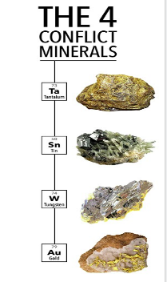
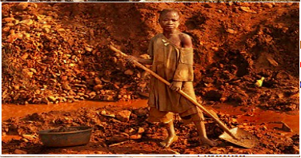
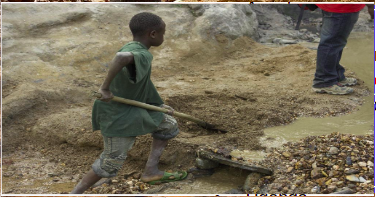
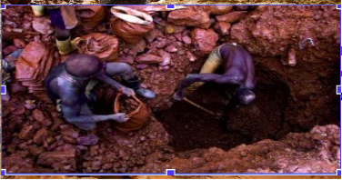
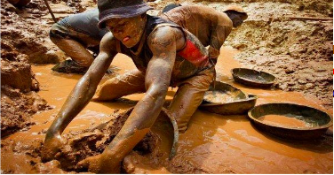
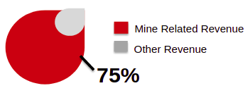
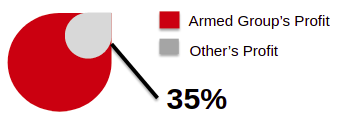
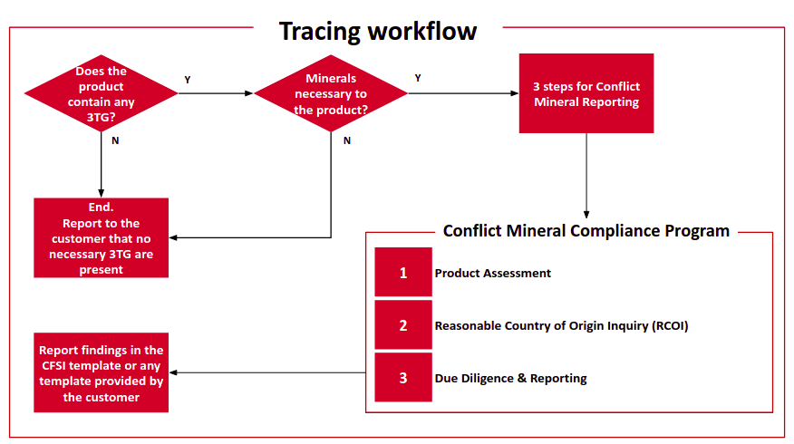
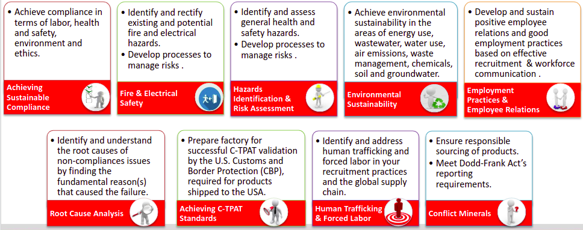

Learn About Conflict Minerals US guidelines for vendor compliance and sustainability

**Index:**

- What are Conflict Minerals? 
- Conflict Minerals in Products
- US Conflict Minerals Laws 
- Auditing and Reporting Requirements 
- Customer’s expectations
- Continuous Tracking
- Tracing workflow
- Reporting – CFSI
- Beyond USA

## **What are Conflict Minerals?** 

**[Conflict Minerals](https://commons.wikimedia.org/wiki/File:Conflict_minerals_curse_image_in_Congo.png)** refer to raw materials that come from a particular part of the world where conflict is occurring and trading of those materials, perpetuates the fighting. Conflict minerals are mined in conditions of armed conflict and human rights abuses, notably in the Democratic Republic of Congo.  
  
The most commonly\* mined conflict minerals are:    
1\. Cassiterite (for **Tin**)  
2\. Wolframite (for **Tungsten**)  
3\. Coltan (for **Tantalum**)  
4\. **Gold**   
They are also known altogether as **3TG** (**T**in, **T**ungsten, **T**antalum, **G**old).

### **“Resource curse” countries**

**Resource countries** of conflict minerals are accounted for 25-30% of the world’s supply of tantalum and smaller % of other three minerals:

- Angola
- Burundi
- Central African Republic
- Democratic Republic of the Congo (“DRC”)
- Republic of Congo
- Rwanda
- South Sudan
- Tanzania
- Uganda
- Zambia

- 
    
- 
    
- 
    
- 
    

Conflict Minerals: Curse countries

#### **HIRING PRACTICES**  

- **Gunpoint**
- **Life threats**
- **Physically forced**
- **Mentally forced ( to protect themselves & family from militias)**

#### **WORKING CONDITIONS**

- **Unhealthy and difficult locations**
- **Unsafe Tools**
- **May lead to death**

## **Conflict Minerals funds wars**

**PEOPLE**: People are **forced** and **threatened** to mine under **extreme violence conditions**, and the money from minerals trade are used to buy weapons that perpetuate wars.

**Over 5,4 Million  
Congo Civil Conflict  Deaths**

## CONGO WAR Status

**310** **Million** Revenue from the conflict minerals trade  
**186 Million** of it spent to fund the Congo War

### **Money:**

**Armed Group Revenue** :  
75% Mine related revenue and others

Fig: Armed group revenue in Congo war

**Congo’s Total Mineral Profits**:  
35% Armed group profits  

Fig: Congo mineral profits

  

## Q&As

- What is the population of your country? 
- How does this number correspond to 5,4 million? e.g equals to one state, one province, one city?

## **Conflict Minerals in Products**

| **Mineral Name** | **Mineral Image** | **Major Use** | **World share from covered countries** | **Top 2 Producers** |
| --- | --- | --- | --- | --- |
| Tin |  | Plating  
Solders for joining pipes and electronic circuits  
Zipper, button  
Jewelry  
Kitchenware  
PVC in soles of shoes | 4% | China - 44.23%  
Indonesia- 21.15% |
| Tantalum |  | Electrical components (e.g. used in mobile phones, computers),   
aircraft and surgical components  
Medical equipment  
Cutting tools  
Video game consoles  
Camera lenses | 29% | Brazil - 26.87%  
Mozambique- 16.86% |
| Tungsten |  | Metal wires,   
Electrodes  
Electric lights  
Garden tools  
Cutting tools  
Electronic, electrical, heating and welding applications | 1.4% | China - 83.2%  
Russia - 4.07% |
| Gold |  | Jewelry,   
Electronic, communications | 2% | China - 13.06%  
USA - 9.10% |

Vendor Compliance & Sustainability (VCS)

## **Risk Level in Top Products**

## **US Conflict Minerals Law**

**[Dodd-Frank](https://www.wikidata.org/wiki/Q59597365) Wall Street Reform and Consumer Protection Act of 2010**. **(Section 1502)**  
**Requires companies to identify where the minerals used in their products came from.**

**Dodd Frank has successfully reduced revenue to militias by 65%**.  
****But 65% of current trade involves smuggling****

## **Auditing and Reporting Requirements**

Dodd Frank Act contains **2 auditing and reporting requirements:**

1. Independent third party supply chain traceability **audits**
2. **Reporting** of audit information to the public and  U.S. Securities and Exchange Commission (SEC)

**Applicability**  
_Companies are required to submit an annual conflict minerals report to the SEC, if:_  
2a_.  they are required to file reports with the SEC under the_ **_Exchange Act of 1934_**_._  
2b. _conflict minerals are_ **_necessary to the functionality or production_** _of a product that they manufacture or contract to be manufactured._ 

Even companies not directly regulated by SEC will be impacted by the audit requirements, because information will run through companies’ entire supply chains.   

companies’ entire supply chains

### **Customer’s expectations**

Customer’s supplier factories should be able to prove that their raw materials used to make customer’s products are conflict free.

### **Conflict-Free Sourcing**

- Provide origin of 3TG with RCOI (Reasonable Country of Origin Inquiry)
- Perform Due Diligence and report to customer 

**How?**  
Have an established **products assessment identification process**, to determine which products contain 3TG minerals  
Be able to conduct **Reasonable Country of Origin Inquiry (RCOI)**, to determine whether minerals originated in the resource countries (DRC especially)  
Be able to conduct **due diligence & report** to customer about potential risks so they can be assessed and managed appropriately

Factory should have a Conflict Minerals Compliance Program in place to be able to report back to customer, concerning its products compliance.

conflict minerals

**Reporting - CFSI**

**The CFSI**:

**Conflict-Free Sourcing  Initiative.**  
  
Founded by the Electronic Industry Citizenship Coalition (EICC) and the Global e-Sustainability Initiative (Gesi).

2 Major activities:

- **Conflict Free Smelter Program (CFSP)**
    - Certifies smelters as producing conflict-free materials
    - Publishes the list of certified smelters online
- **The Conflict Minerals Reporting Template** (CMRT, also referred to as EICC template)
    - Most widely used Conflict Minerals reporting template

**Companies’ disclosure**:  

In 2014 SEC asked , all registered companies to comply with the conflict minerals law:

- 1,300 companies submitted conflict minerals filings to the SEC 
- almost 1,000 of which included a Conflict Minerals Report

In 2015, more and more companies started publicly disclosing their supply chain’s conflict minerals reports.

In 2016…

## **Beyond USA**

  
In October 2014, China Chamber of Commerce of Metals, Minerals and Chemicals Importers and Exporters (CCCMC) requested Chinese companies to comply with a new set of due diligence guidelines

  
In March 2014, _EU_ drafted a regulation proposal on supply chain due diligence. 

  
The Australian government released due diligence guidelines for the responsible supply chain of minerals to mitigate the risk of providing direct or indirect support for conflict in the DRC

  
Canada, Vancouver (BC), is considering actions to prevent city budgets funds from unwittingly providing support to conflict minerals

  
Organization for Economic Cooperation and Development (OECD) has issued a Due Diligence Guidance for Responsible Supply Chains of Minerals from Conflict-Affected and High-Risk Areas.  There are 34 member countries of OECD at present.

#### **Continuous tracking**

Continuous tracking of your suppliers / smelters and the origin of your products will ensure compliance in your operations and easier tracking and reporting to your customers and the industry.

## **Building factories’ sustainable compliance operations**

Offering: 

- Capacity building (CB) programs in the form of classroom trainings & seminars
- Remediation services
- E-learning programs and webinars
- Easy access to our resources from the Sustainability Resource Center (SRC) website 

**Training programs offered:**

Training program: Conflict Minerals
