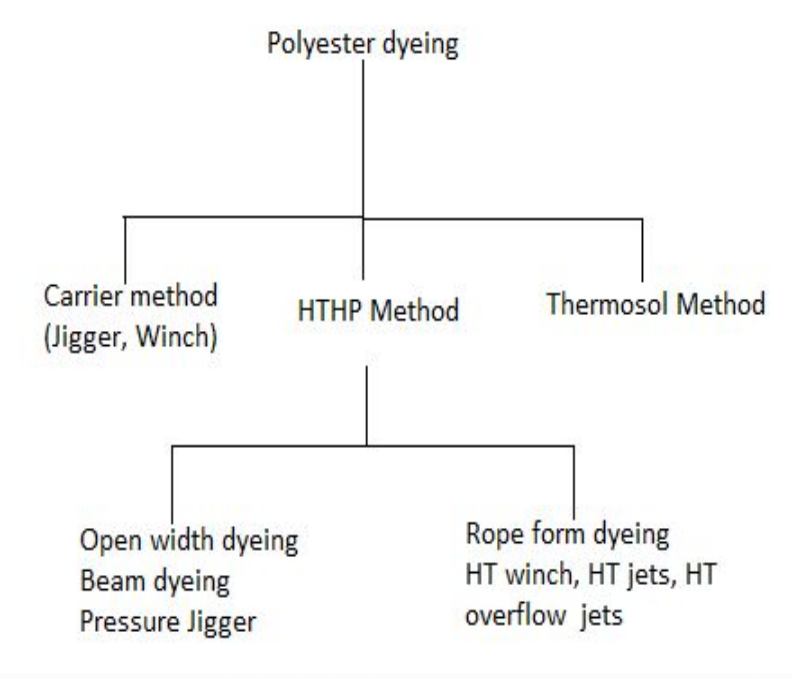
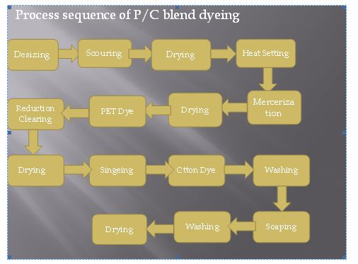
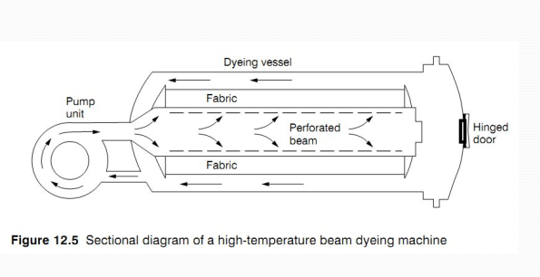
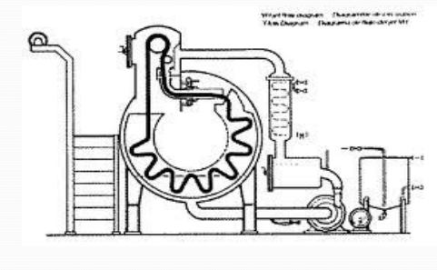
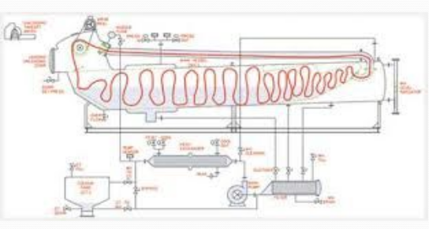

## Classification of the methods for  
dyeing of P/C blend

Exhaust dyeing method or batch dyeing method- 
This is again classified in the following three groups- 
a. Two bath dyeing  
b. One bath one step dyeing  
C. One bath two-step dyeing method  
Thermosol Dyeing method - 
It is again classified into two groups- 
a. Continuous dyeing- 
b. Pad batch process (semi-continuous)  
Note-In continuous dyeing process may be single bath  
or double bath.

### EXHAUST DYEING-

Two bath dyeing  
This is the process in which we have to dye first polyester  
part in the HTHP beam dyeing machine or HTHP jet  
dyeing machine and the cotton part is dyed in the jigger  
machine.  
Batch process  
Machine used for dyeing of polyester part- 
i) HTHP Beam dyeing machine( First commercialized  
HTHP machine)  
ii) HTHP jet dyeing machine  
Machine used for dyeing of cotton part- 
Jigger dyeing machine

Polyester Dyeing

### PROCESS ROUTE P/C BLEND  
DYEING-

Process route P/C blend dyeing

### MACHINE FOR POLYESTER DYEING-

HTHP beam dyeing machine- 
No need to explain the whole process of dying in a beam dyeing  
machine. Only some important points we will discuss it- 
Advantages & features:  
Loading and unloading of the fabric are easy and the time of dyeing is  
short.  
Dyeing in open width form.  
Most suitable for those fabrics that might crease, extend or  
abrade when dyed in machines where the fabric is in motion.  
Not appropriate for compact fabrics  
De-aeration is essential to avoid paler-dyed spots.  
A wetting agent helps to eliminate air bubbles within the fabric  
roll.

Best blanket to keep you warm

<iframe style="width:120px;height:240px;" marginwidth="0" marginheight="0" scrolling="no" frameborder="0" src="//ws-na.amazon-adsystem.com/widgets/q?ServiceVersion=20070822&amp;OneJS=1&amp;Operation=GetAdHtml&amp;MarketPlace=US&amp;source=ss&amp;ref=as_ss_li_til&amp;ad_type=product_link&amp;tracking_id=cableboy0a-20&amp;language=en_US&amp;marketplace=amazon&amp;region=US&amp;placement=B07C1PBDLX&amp;asins=B07C1PBDLX&amp;linkId=d2262af252037b37058f6fa6ad526b23&amp;show_border=true&amp;link_opens_in_new_window=true"></iframe>

### Recipe used HTHP dyeing –

Disperse dye- X%(depends upon the shade)  
Dispersing agent-1g/l  
Sequestering agent-1-2g/l(If required)  
Defoamers -.5 to 1g/l  
Leveling agent-.5 to 1 g/l  
Wetting agent- .5g/l  
Acetic acid is enough to get ph=5-6Flow of the liquor usually in the in-to-out direction,  
but it can be reversed. Out-to-in flow can compress  
the material causing flattening and glazing, particularly  
on the inner layers.  
Material stationary and liquor is moving.  
Batching is very important, during batching tension  
should be uniform and optimum.  
M:L ratio is 1:10  
Both cloth and yarn can be dyed on this machine

### HTHP BEAM DYEING MACHINE-

HTHP BEAM DYEING MACHINE

### Disadvantages of beam dyeing  
machine-

The fabric of different width can not be dyed together on a  
single beam.  
The dyed fabric may be displayed moiré effect if it is  
tightly due to shrinkage.  
Uneven dyeing may occur if the beam is fully loaded, as the dye liquor has penetrated several layers of fabric.

### JET DYEING MACHINE-

JET DYEING MACHINE

JET DYEING MACHINE

### HTHP jet dyeing machine

The jet dyeing machine is an extension of the HPHT winch  
dyeing machine. Jet dyeing machine developed by  
BURLINGTON Industries and first machine developed in  
1963 by Gaston country Machine co. of U.S.A  
**Features:  
**Both material and liquor are moving.  
Dyeing in rope form.  
Fabric speed is usually 200-250mt/min  
The jet dyeing can usually be operated up to 140 0 c under high  
pressure and having capacity capable of dyeing 100 to 150  
kg of fabric at a time.

### **Chemicals added**

Acids  
Buffers  
Sequestering agent  
Anticrease agent  
Defoamers  
Leveling agent

Dye Kit To Color at Home

<iframe style="width:120px;height:240px;" marginwidth="0" marginheight="0" scrolling="no" frameborder="0" src="//ws-na.amazon-adsystem.com/widgets/q?ServiceVersion=20070822&amp;OneJS=1&amp;Operation=GetAdHtml&amp;MarketPlace=US&amp;source=ss&amp;ref=as_ss_li_til&amp;ad_type=product_link&amp;tracking_id=cableboy0a-20&amp;language=en_US&amp;marketplace=amazon&amp;region=US&amp;placement=B08HK5G5GM&amp;asins=B08HK5G5GM&amp;linkId=a3957639e7b43156c06cb11851d4b1a2&amp;show_border=true&amp;link_opens_in_new_window=true"></iframe>

### DEVELOPMENT IN JET DYEING  
MACHINE-

Soft flow jet- slow motion of the fabric. Suitable for knitted  
fabric  
Superjet dyeing machine- M:L is 1:1  
Aerodynamic jet dyeing machine  
Jet created by a mixture of air + water  
M:L is 1:1, drain out at a 130c  
Multi-nozzle sot flow jet dyeing machine

### Advantages of jet dyeing machine:

The fabric of two different widths can be dyed at a time so  
that two lots can be combined together for dyeing.  
No special batching device is required for winding the  
fabric as in beam dyeing.  
There is no flattening effect or uneven dyeing on the  
fabric as in beam dyeing.

Download a full research paper on Dyeing of Polyester and Cotton Blend

[Click here to download](https://drive.google.com/file/d/18KYgfCG6SSOqs5ksvira4dvoZMSz5pUY/view?usp=sharing)
