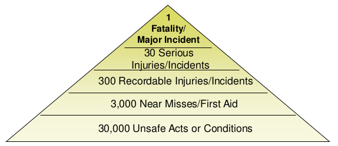

## What Industrial Supplier Compliance Manual said?

- Hazard identification and risk assessment (HIRA) should be  
    performed for all activities conducted at the facility, and include off-site activities are related to the Supplier’s business.
- HIRA should be contradicted at least once (1) per year
- EHS risk assessment should include

## Why we need Hazard Identification and Risk Assessment at Workplace Level?

- As part of the key aspects of Risk Management, it aims to:-
- Reduce the likelihood and consequence of a workplace incident that may result in injury or disease
- Free from significant risks in the factory workplace
- Control risks and prevent workplace injuries

**The Risk Pyramid**

From: A.W. Heinrich, Industrial Accident Prevention: A Scientific Approach, McGraw Hill, NY 1931

## The Iceberg Theory

**Direct Costs (Obvious)**

- Medical expenses (doctor visits, physical therapy, medicine, etc.), claim, repair or replace damages
- Litigation due to workplace injury /environmental violation Indirect Costs (Not Obvious)
- Administrative costs
- Lost supervisory/service time
- Co-worker’s lost time during emergency / HSE incidence
- Learning curve of replacement worker
- Ruined services
- Overtime for operations to catch up back
- Legal fees
- Capital cost increased due to resource consumption / energy usage
- Reduced morale & productivity
- Negative publicity
- Damage to customer relations

## What Is a Hazard?

**An act or condition that:**

- Can cause impact/harm or situation with the potential to cause loss on people or the environment;
- Violates laws;
- Violates company policy, standards, or requirements.

## Example Classification of Occupational Safety and Health Hazard

<table><tbody><tr><td>Chemical</td><td>Physical</td><td>Biological</td><td>Ergonomic</td><td>Psychological</td><td>General Safety</td></tr><tr><td>Fumes Gases Liquids Particulate Dusts Vapors</td><td>Non ionizing radiation (e.g lasers, radio frequencies, microwaves, ultraviolet light) Pressure Vibration O2 deficiency</td><td>Insect (e.g, ants,bees, scorpions, spiders, mosquitoes) Microbes (e.g, bacteria (tuberculosis), parasites, viruses (hepatitis B, HIV, others)) Toxic plants (e.g, poison oak) Reptiles (e.g, drinking water, hygiene facilities) Small mammals (e.g, dogs, rodents, skunks) ²Potentially violent people</td><td>Circadian rhytm (e.g, shift work/ rest cycles) Fatigue (extended work hours) ¹Hand tools ²Manual material handling (e.g, biomechanics, lifting, pushing, pulling, carryng) ²Work station design (e.g, dials, controls, signals, labeling, office (computer) workstations)</td><td>Mental task overload Stress (occupational and non-occupational) Substance abuse Repetitive physiological Organization behavior</td><td>¹Construction ¹Maintenance ¹Electrical ¹Emergencies ¹Enviromental conditions ¹Fires/ explosion ¹Mechanical and machinery systems ¹Motorized equipment ¹Pressurized systems ¹Fall protection ¹Motor vehicle occupant safety</td></tr></tbody></table>

Note : All hazard must be addresses in employer’s overall safety and health program if present at work site  
¹Employee safety health regulations adopted  
²Employee safety health regulation in development (1995)

## METHODS TO IDENTIFY HAZARDS

- Review legislation & code of practices
- Accident data
- Observe
- MSDS
- Inspections
- JSA ( Job Safety Analysis) etc

## What Is a Risk?

- Poorly managed or unmanaged hazards
- The probability of a specific adverse effect to occur :
- Injury
    - Illness
    - Environmental impact
    - Non-compliance with regulatory standards
    - Non-compliance with company standards

## DEFINITION: RISK ASSESSMENT

RISK ASSESSMENT: A careful examination of what in the workplace, could cause harm to people, so that you can weigh up whether you have taken enough precautions or should do more to prevent harm. The aim is to make sure no-one gets hurt or becomes ill.

## Risk Assessment

• Risk = Severity X Probability  
• Risk shall be assessed  
• Process hazards  
• Conformance with organizational standards and regulations

To be continued...
