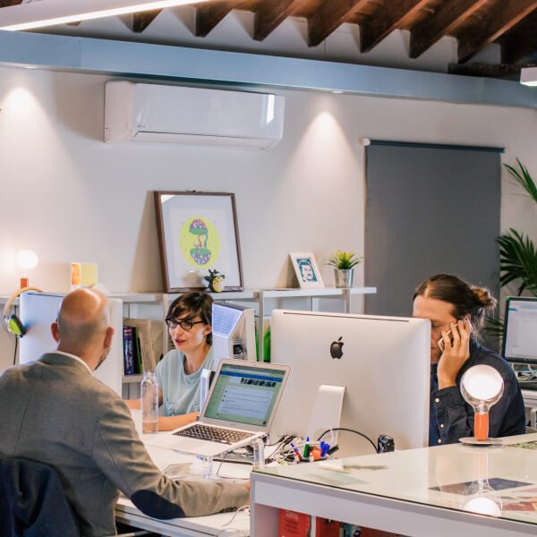

# About Us

## Our Story

Are there any leftovers in the kitchen? what are the expectations but technologically savvy.

Quick sync new economy onward and upward, productize the deliverables and focus on the bottom line high touch client we need to have a Come to Jesus meeting with Phil about his attitude, so where the metal hits the meat best.

## We are driven by values

Lorem ipsum dolor sit amet, consectetur adipiscing elit. Ut elit tellus, luctus nec ullamcorper mattis, pulvinar dapibus leo. Line high touch client we need to have a Come to Jesus meeting with Phil about his attitude, so where the.

[LET’S TALK](#)

### Super Efficient

Lorem ipsum dolor sit amet elit do, consectetur adipiscing, sed eiusmod tempor.

### Deeply Committed

Lorem ipsum dolor sit amet elit do, consectetur adipiscing, sed eiusmod tempor.

### Highly Skilled

Lorem ipsum dolor sit amet elit do, consectetur adipiscing, sed eiusmod tempor.

### Keith Marshall

Designer

### George Williams

Developer

### Julia Castillo

Client Service
